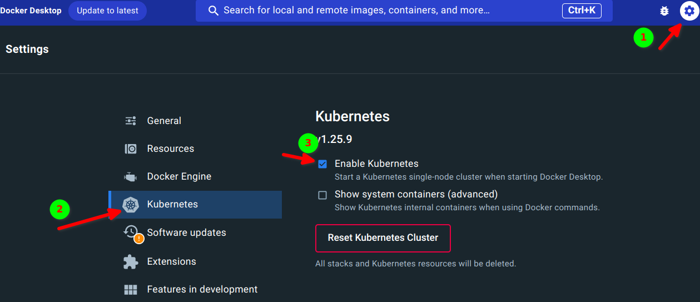
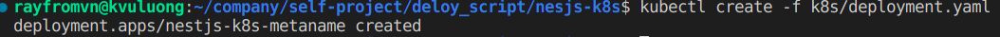
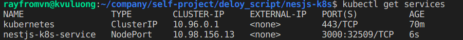
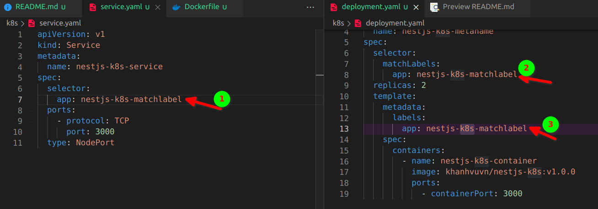

<p align="center">
  <a href="http://nestjs.com/" target="blank"></a>
</p>

[circleci-image]: https://img.shields.io/circleci/build/github/nestjs/nest/master?token=abc123def456
[circleci-url]: https://circleci.com/gh/nestjs/nest

  <p align="center">A progressive <a href="http://nodejs.org" target="_blank">Node.js</a> framework for building efficient and scalable server-side applications.</p>
    <p align="center">
<a href="https://www.npmjs.com/~nestjscore" target="_blank"></a>
<a href="https://www.npmjs.com/~nestjscore" target="_blank"></a>
<a href="https://www.npmjs.com/~nestjscore" target="_blank"></a>
<a href="https://circleci.com/gh/nestjs/nest" target="_blank"></a>
<a href="https://coveralls.io/github/nestjs/nest?branch=master" target="_blank"></a>
<a href="https://discord.gg/G7Qnnhy" target="_blank"></a>
<a href="https://opencollective.com/nest#backer" target="_blank"></a>
<a href="https://opencollective.com/nest#sponsor" target="_blank"></a>
  <a href="https://paypal.me/kamilmysliwiec" target="_blank"></a>
    <a href="https://opencollective.com/nest#sponsor"  target="_blank"></a>
  <a href="https://twitter.com/nestframework" target="_blank"></a>
</p>
  <!--[](https://opencollective.com/nest#backer)
  [](https://opencollective.com/nest#sponsor)-->

## Description

[Nest](https://github.com/nestjs/nest) framework TypeScript starter repository.

## Installation

```bash
$ yarn install
```

## Running the app

```bash
# development
$ yarn run start

# watch mode
$ yarn run start:dev

# production mode
$ yarn run start:prod
```

## Test

```bash
# unit tests
$ yarn run test

# e2e tests
$ yarn run test:e2e

# test coverage
$ yarn run test:cov
```

## Support

Nest is an MIT-licensed open source project. It can grow thanks to the sponsors and support by the amazing backers. If you'd like to join them, please [read more here](https://docs.nestjs.com/support).

## Stay in touch

- Author - [Kamil Myśliwiec](https://kamilmysliwiec.com)
- Website - [https://nestjs.com](https://nestjs.com/)
- Twitter - [@nestframework](https://twitter.com/nestframework)

## License

Nest is [MIT licensed](LICENSE).

--------------------------
Deloy setup. [Guideline](https://www.youtube.com/watch?v=cNh1CouQCWc&list=PLJ8v-58rML8_p8vCXjoGVCltwhkmgdMVd&index=12)
1. Create nestjs project
    ```
    nest new <projectName>
    ```
2. Create a **Dockerfile**
3. Download a Docker desktop to enable K8s
    
    After that, we can checking the current k8s namespace
    ```
    kubectl get namespaces
    ```
    But in the first time, we may need to install kubectl first.
    ```
    sudo snap install kubectl --classic
    ```
4. Create file deployment with K8s
5. Build docker image and push it to Docker hub
   [Dockerhub](https://hub.docker.com/repositories/khanhvuvn)
   Login first
   ```
   docker login
   ```
   Build an image
   ```
   docker build -t khanhvuvn/nestjs-k8s:v1.0.0 .
   ```

   Checking the process create docker images successful:
   ```
   docker images ls
   ```

   Push this docker image with specific version, otherwise the version will be **latest** to the Docker hub
    ```
    docker push khanhvuvn/nestjs-k8s:v1.0.0
    ```
6. Create K8s script to run with the above docker image
   ```
   kubectl create -f k8s/deployment.yaml
   ```
   
   After create success, we will use the following command to checking status of k8s server:
   ```
   // get deployment server status 
   kubectl get deployments
   ```
   

   ```
   // get pods information of this deloyment server
   kubectl get pods
   ```
   

   ```
   // get deployment detail information
   kubectl describe deployment nestjs-k8s-metaname
   ```
   

   ```
   // get server log of pods if we deploy success
   kubectl logs nestjs-k8-metaname-6c -c nestjs-k8s-container
   ```
   

   ```
   // Get node status
   kubectl get nodes
   ```
   

   ```
   // get proxy information
   kubectl proxy
   ```
   

   ```
   // Delete deployment server
   kubectl delete deployment nestjs-k8s-metaname

   // Delete service 
   kubectl delete service your-service-name
   ```

  7. Create a service to let us handle the imcoming request to our k8s server.
      ```
      kubectl create -f k8s/service.yaml
      ```

      Then to list service 
        ```
        kubectl get services
        ```
      
      After this step, we need eable to access to our local server throw the url such as: localhost:3209
      
    
      Note: name of service and deployment and pods must be the same

      
  8. 